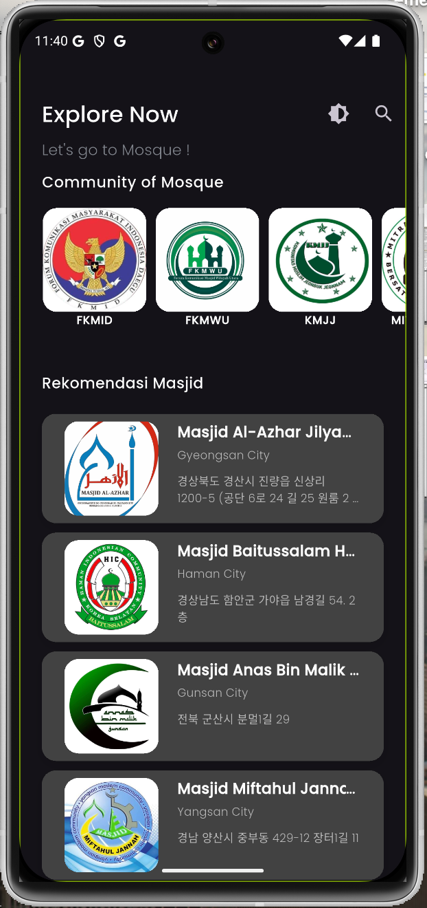
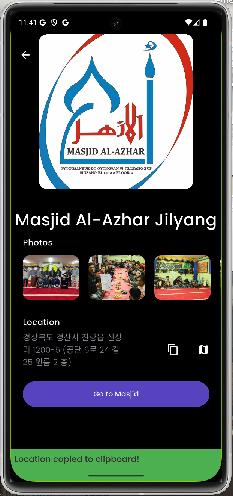
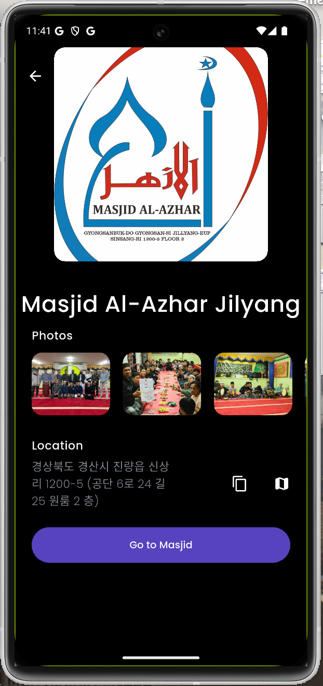
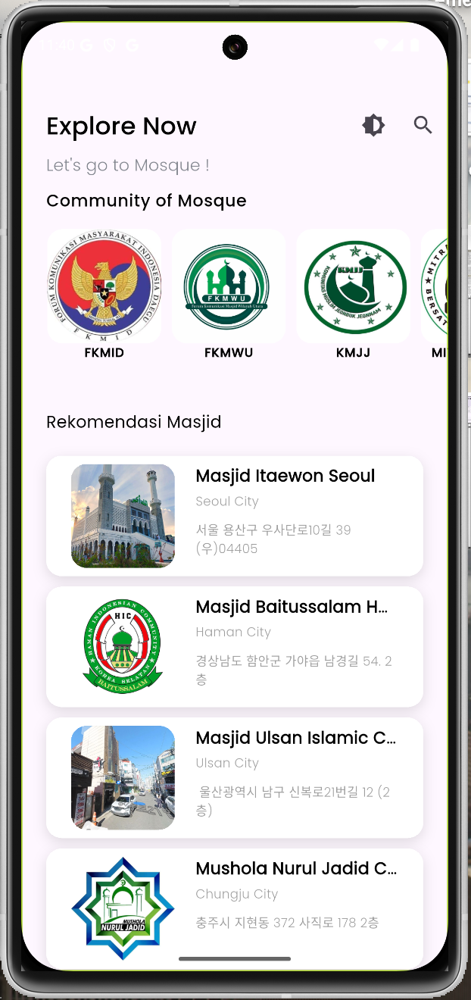
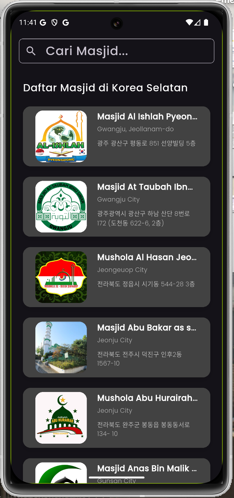
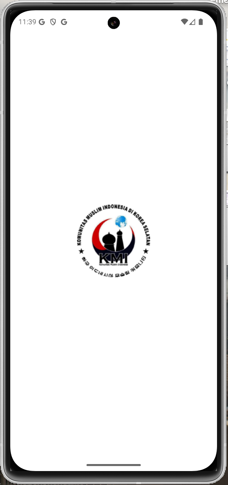
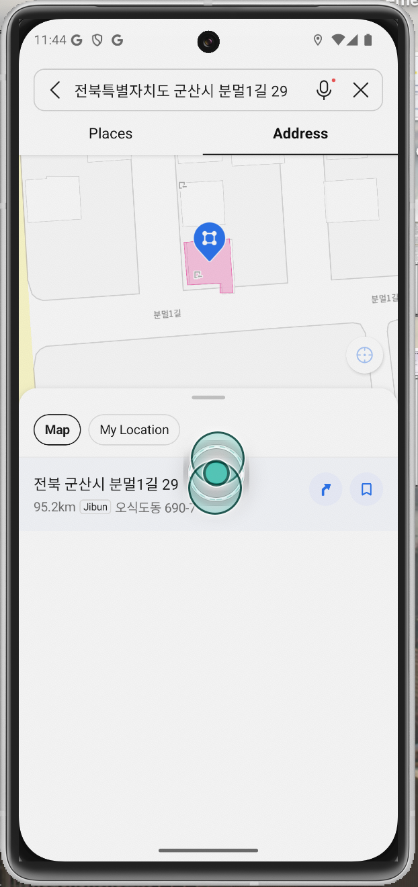

# 📍 Masjid Korea - Aplikasi Pencari Masjid di Korea Selatan

## 🌟 Deskripsi Proyek

Masjid Korea adalah aplikasi pencari masjid terdekat di Korea Selatan yang dibuat dengan **Flutter** menggunakan **State Management BLoC (Cubit)** dan pendekatan **Clean Architecture** agar lebih mudah di-maintain dan scalable untuk pengembangan ke depan.

Aplikasi ini menyediakan informasi lengkap tentang masjid-masjid yang ada di Korea Selatan, termasuk:
✅ Nama Masjid 🕌\
✅ Alamat 📍\
✅ Foto-foto kegiatan 📷\
✅ Navigasi ke masjid menggunakan **KakaoMap** 🗺️

Selain itu, aplikasi ini juga memiliki fitur tambahan seperti:

- **Perhitungan Jarak dengan Rumus Haversine** 📏: Menghitung jarak antara lokasi pengguna dan masjid menggunakan koordinat **latitude** dan **longitude**.
- **Penyimpanan Data di Firebase Cloud Firestore** ☁️: Menyimpan data secara real-time dan memungkinkan integrasi mudah antara aplikasi dan database.
- **Animasi Menarik dengan Lottie** 🎭: Menggunakan **Lottie animations** untuk animasi loading agar tampilan lebih interaktif dan menarik.
- **Mode Terang & Gelap** 🌞🌙: Menyesuaikan tampilan aplikasi sesuai dengan preferensi pengguna.

## 🛠️ Teknologi yang Digunakan

- **Flutter** (Framework utama) 🚀
- **State Management BLoC (Cubit)** 🔄
- **Firebase Cloud Firestore** 🔥
- **Geolocator & Location Package** 📌
- **KakaoMap API** 🗺️
- **Dio (HTTP Client)** 🔗
- **Lottie (Animations)** 🎨

## 📦 Dependencies

```yaml
name: masjid_korea
description: "Aplikasi Masjid di Korea Selatan"

publish_to: "none"
version: 1.0.0+1

environment:
  sdk: ^3.7.0

dependencies:
  flutter:
    sdk: flutter
  cupertino_icons: ^1.0.8
  bloc: ^9.0.0
  equatable: ^2.0.7
  cloud_firestore: ^5.6.5
  url_launcher: ^6.3.1
  geolocator: ^13.0.2
  location: ^8.0.0
  flutter_bloc: ^9.1.0
  dio: ^5.8.0+1
  google_fonts: ^6.2.1
  firebase_core: ^3.12.1
  html: ^0.15.5
  web: ^1.1.1
  webview_flutter: ^4.10.0
  cached_network_image: ^3.4.1
  browser_launcher: ^1.1.3
  lottie: ^3.3.1

dev_dependencies:
  flutter_launcher_icons: ^0.14.3
flutter_icons:
  android: true
  ios: true
  image_path: "assets/logo_kmi.png"

  flutter_test:
    sdk: flutter
  flutter_lints: ^5.0.0

flutter:
  uses-material-design: true
  assets:
    - assets/
```

## 🚀 Cara Menjalankan Proyek

1. **Clone repository** ini ke dalam komputer kamu:
   ```sh
   git clone https://github.com/username/masjid_korea.git
   ```
2. Masuk ke folder proyek:
   ```sh
   cd masjid_korea
   ```
3. **Install dependencies**:
   ```sh
   flutter pub get
   ```
4. **Jalankan aplikasi**:
   ```sh
   flutter run
   ```

## 📸 Screenshot Aplikasi

📷 (Tambahkan beberapa screenshot aplikasi di sini)

## 🤝 Kontribusi

Kontribusi sangat terbuka! Jika ingin menambahkan fitur atau memperbaiki bug, silakan buat **pull request** atau **issue**.

## 📬 Kontak

📧 Email: [rulyoctareza@gmail.com](mailto:rulyoctareza@gmail.com)\
💼 LinkedIn: [www.linkedin.com/in/rulyoctareza](http://www.linkedin.com/in/rulyoctareza)

---

# 📍 Masjid Korea - Mosque Finder App in South Korea

## 🌟 Project Description

Masjid Korea is a mosque finder app in **South Korea** built with **Flutter**, using **State Management BLoC (Cubit)** and **Clean Architecture** for better maintainability and scalability.

This app provides complete information about mosques in South Korea, including:
✅ Mosque Name 🕌\
✅ Address 📍\
✅ Activity Photos 📷\
✅ Navigation to the mosque using **KakaoMap** 🗺️

Additional features:

- **Distance Calculation using Haversine Formula** 📏: Calculates the distance between the user's location and the mosque using **latitude** and **longitude**.
- **Firebase Cloud Firestore Integration** ☁️: Stores data in real-time, ensuring easy integration between the app and the database.
- **Lottie Animations** 🎭: Enhances the user experience with interactive and engaging animations.
- **Light & Dark Mode Support** 🌞🌙: Provides a better visual experience for users.

## 🛠️ Technologies Used

- **Flutter (Main Framework)** 🚀
- **State Management BLoC (Cubit)** 🔄
- **Firebase Cloud Firestore** 🔥
- **Geolocator & Location Package** 📌
- **KakaoMap API** 🗺️
- **Dio (HTTP Client)** 🔗
- **Lottie (Animations)** 🎨

## 📦 Dependencies

(See YAML dependencies above)

## 🚀 How to Run the Project

1. **Clone this repository**:
   ```sh
   git clone https://github.com/username/masjid_korea.git
   ```
2. Navigate to the project directory:
   ```sh
   cd masjid_korea
   ```
3. **Install dependencies**:
   ```sh
   flutter pub get
   ```
4. **Run the app**:
   ```sh
   flutter run
   ```

## 📸 App Screenshots

📷 (Add some screenshots here)

## 🤝 Contribution

Contributions are welcome! Feel free to open a **pull request** or **issue** if you find any bugs or want to add features.

## 📬 Contact

📧 Email: rulyoctareza@gmail.com
💼 LinkedIn: www.linkedin.com/in/rulyoctareza

---

Terima kasih telah membaca! Semoga aplikasi ini bermanfaat bagi banyak orang! 🚀😃
















